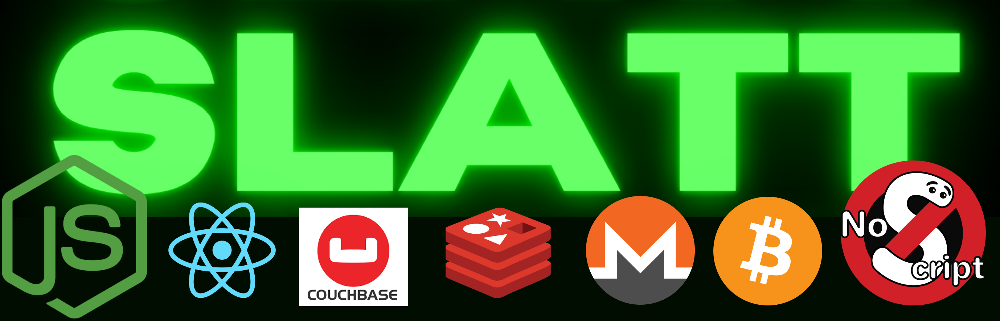
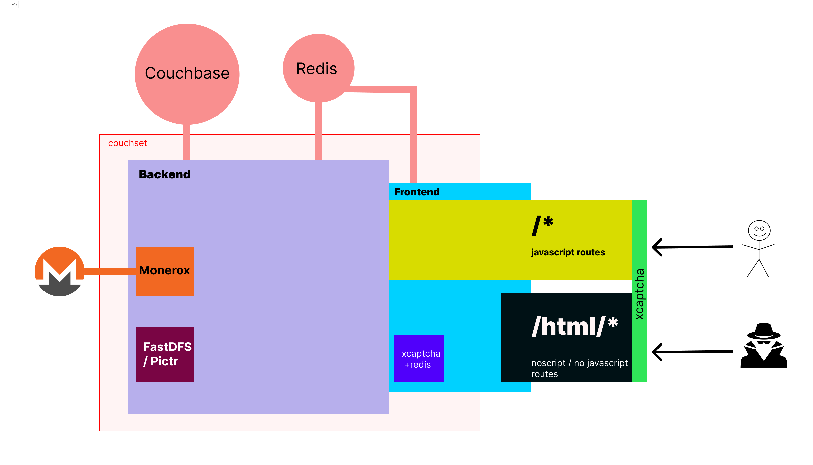

<h1 align="center">
SSLATT (OSS marketplace) - backend
</h1>

<h3 align="center">
Super Slime 🐍 Love All The Time
</h3>

<p align="center">
  <a href="#"></a>
</p>

## Sponsors

<table width="100%">
  <tr height="187px">
    <td align="center" width="33%">
      <a href="mailto:support@stoqey.com">
        Add your logo here
      </a>
    </td>
  </tr>
</table>

## Features

| Name                    | Description |
| ----------------------- | ----------- |
| PGP 2FA                 | ✅          |
| Autowithdraw            | ✅          |
| BTC, XMR                | ✅          |
| Escrow / FE             | ✅          |
| Multisig support        | 🔄          |
| Jabberbot               | 🔄          |
| FE disputes             | 🔄          |
| Auto dispute resolution | 🔄          |
| Walletless pay          | 🔄          |

<p align="center">
  
</p>

### Features backend

| Name     | Description                                                                                                                                               |
| -------- | --------------------------------------------------------------------------------------------------------------------------------------------------------- |
| Database | Couchbase via [Couchset ORM](https://github.com/couchset)                                                                                                 |
| API      | Apollo GraphQL via [RoadmanJS Framework](https://github.com/roadmanjs)                                                                                    |
| Payments | BTC(btcpayserver), XMR(monero rpc) via [RoadmanJS Wallet](https://github.com/roadmanjs/wallet), [RoadmanJS MoneroX](https://github.com/roadmanjs/monerox) |
| Auth     | JWT, 2FA via [RoadmanJS Auth](https://github.com/roadmanjs/auth)                                                                                          |
| Storage  | Local disk / FastDFS via [RoadmanJS](https://github.com/roadmanjs)                                                                                        |

### Requirements

- Node.js 18+ and npm
- Couchbase
- Redis
- BTCPayerServer or monero rpc

## Getting started backend

Run the following command on your local environment:

```shell
git clone git@github.com:stoqey/sslatt-backend.git
yarn
```

Then, you can run the project locally in development mode with live reload by executing:

```shell
yarn dev
```

Open http://localhost:3000 with your favorite browser to see your project.

### Environment

#### Set up authentication

```shell
PORT=3037
APP_NAME=sslatty
DEBUG=sslatty*

# 32 chars each
ACCESS_TOKEN_SECRET=random ass string
REFRESH_TOKEN_SECRET=random ass string
```

#### Database and Storage

Set up couchbase and redis

```shell
COUCHBASE_URL=
COUCHBASE_BUCKET=dev
COUCHBASE_USERNAME=admin
COUCHBASE_PASSWORD=

REDIS_URL="rediss://:xxxxxxxx@xxxxxxxx:30296"
```

Default storage is set to local uploads, but you can set fastdfs, pictr e.t.c


#### Database migration
To set up db indexes, and initial data pass the `STARTUP` env with any value, this will populate the database with the defined config from `src/config` i.e categories, site settings, admin user e.t.c

```shell
STARTUP=anyvalue
```

Once app is up and running you can remove the `STARTUP` env 


#### Set up Payments XMR/BTC

You can accept payments using BTC with btcpayserver or XMR with Monerox

```shell
#BTCPAYSERVER ENV
BTCPAYSERVER_TOKEN=xxxxx
BTCPAYSERVER_STORE=xxxxx
BTCPAYSERVER_URL=https://xxxxxxx.com/api/v1
BTCPAYSERVER_BTC=S-xxxxxx-BTC
BTCPAYSERVER_XMR=S-xxxx-XMR
BTCPAYSERVER_CRON_ENABLED=BTC,XMR
BTCPAYSERVER_CRON=*/1 * * * *

# MONEROX
MONEROX_URL=same as backend url
MONEROX_WALLET=xxxx-xxx-xx-xxx-xxxxxx
MONEROX_CRON=*/1 * * * *

# WALLET RPC
WALLET_RPC_URL=http://xxxxxxxxx:38084
WALLET_RPC_USER=rpc_user
WALLET_RPC_PASSWORD=abc123

# MAIN wallet
WALLET_PATH=abc123
WALLET_PASSWORD=abc123
WALLETS_DIR=/Users/ceddy/xmr/xwallet
```

#### Backend structure

```shell

├── README.md                             # README file
├── .env                                  # Environment configuration
├── .github                               # GitHub folder
├── .vscode                               # VSCode configuration
├── src                                   #
│   └── config                            # Config
│   │   ├── categories.ts                 # Site categories
│   │   ├── site.ts                       # Site settings, admin user, welcome message, e.t.c
│   └── feature                           # Feature e.g. auth, user, wallet
│   │   ├── feature.model.ts              # feature couchbase model / collection / table
│   │   ├── feature.methods.ts            # feature methods
│   │   ├── feature.resolver.ts           # feature graphql api resolver
└── tsconfig.json                         # TypeScript configuration
```

#### Backend customization

Use the `src/config` to set site settings, categories, admin user, welcome message

- `src/config/categories.ts`: categories
- `src/config/site.ts`: site settings configuration file, admin user, welcome message
- `.env`: default environment variables

## Sponsors

<table width="100%">
    <td align="center" width="33%">
      <a href="mailto:support@stoqey.com">
        Add your logo here
      </a>
    </td>
  </tr>
</table>

---

<p align="center">
  <a alt="Sponsor SSLATT" href="https://github.com/sponsors/stoqey"></a>
</p>

<h3 align="center">
Algo Inc
</h3>
